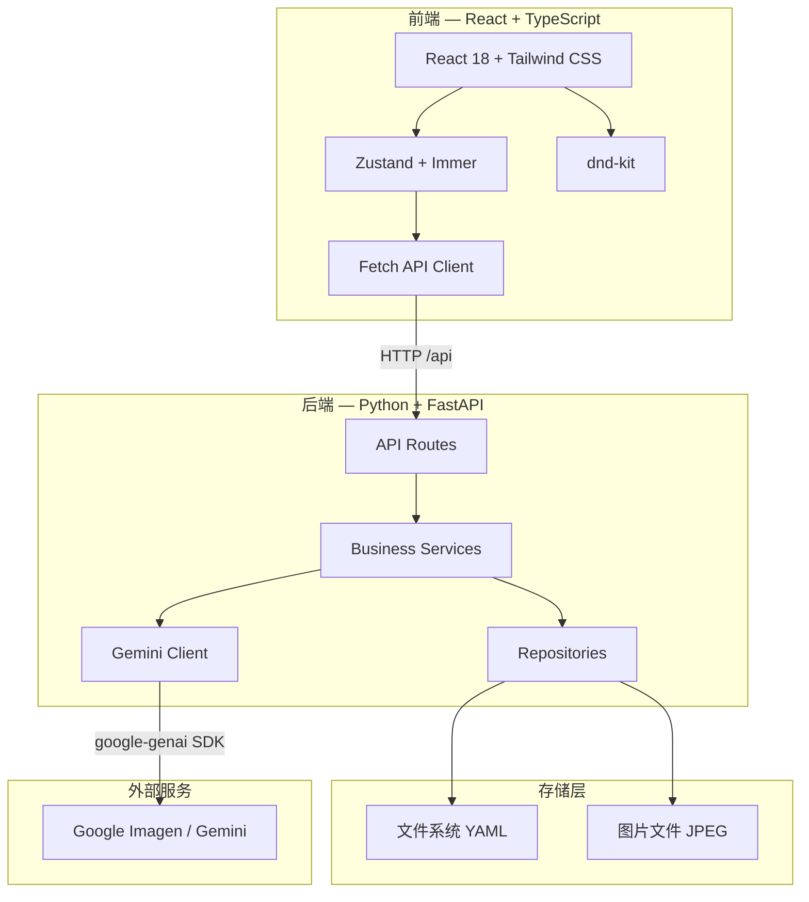
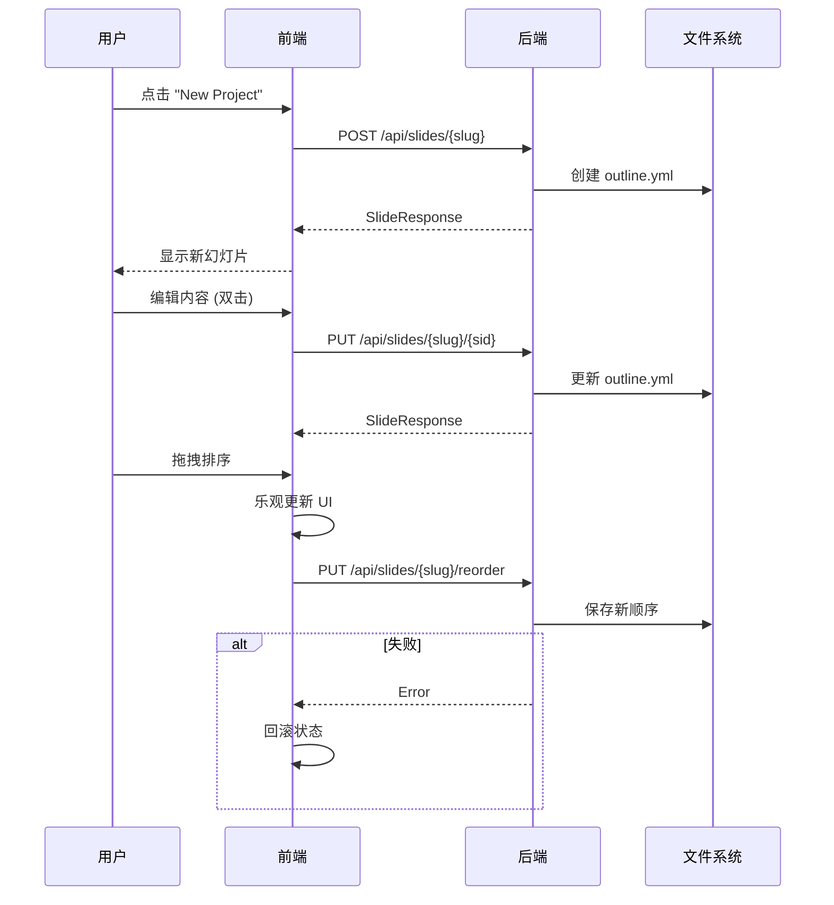
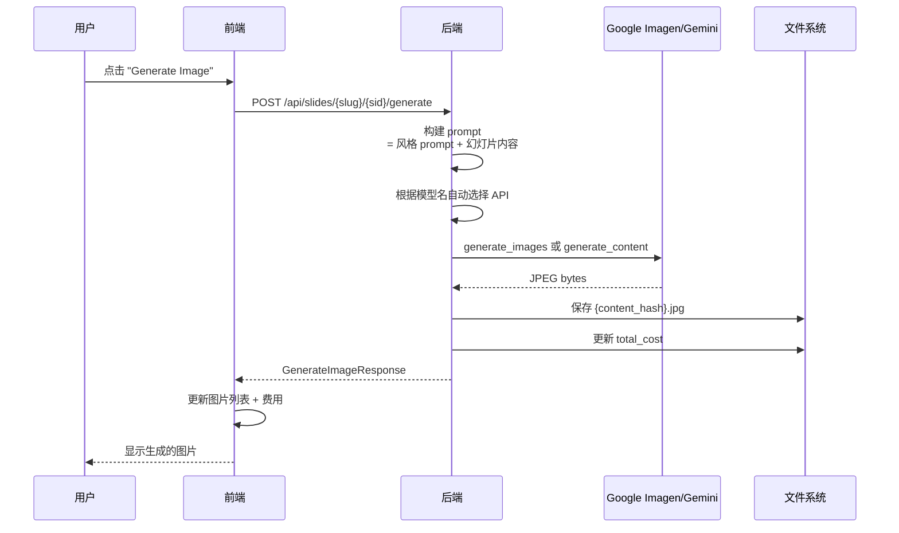
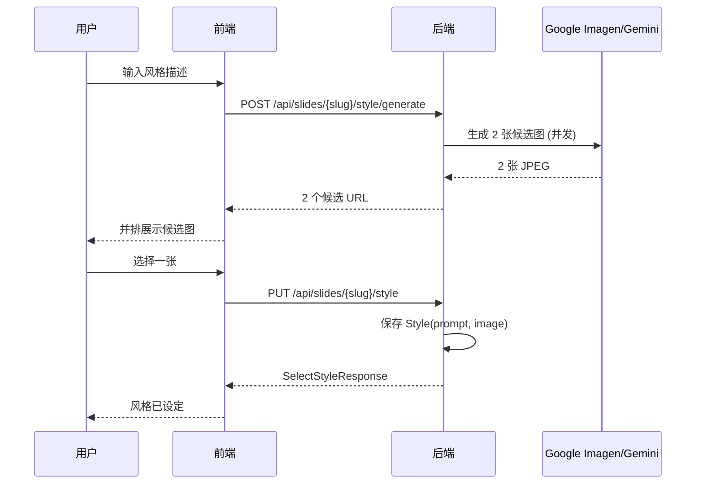
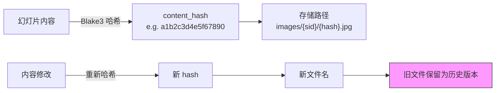
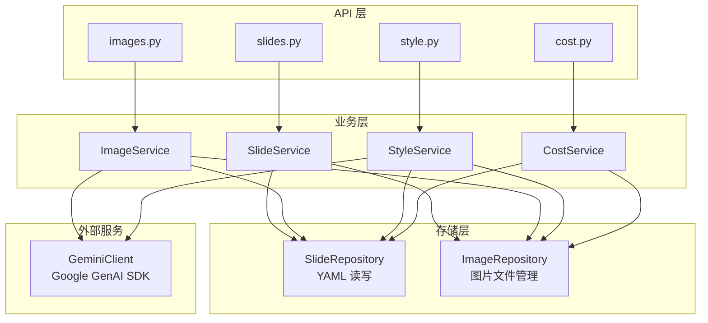
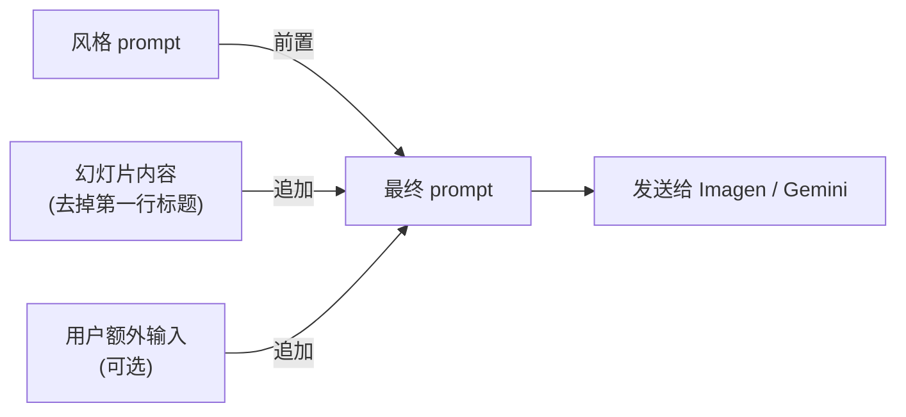

# Prism

AI 驱动的幻灯片图片生成工具。输入文字描述，通过 Google Imagen / Gemini 生成配图，支持风格一致性、版本管理和全屏播放。

## 功能特性

- **AI 图片生成** — 支持 Google Imagen 和 Gemini 模型，从文字 prompt 生成高质量配图
- **风格系统** — 设定全局视觉风格，所有图片自动保持风格一致
- **内容寻址版本管理** — 图片按内容哈希存储，修改内容自动生成新版本，历史版本可回溯
- **拖拽排序** — @dnd-kit 实现幻灯片拖拽重排，乐观更新 + 失败回滚
- **全屏播放** — 浏览器 Fullscreen API，自动轮播，键盘导航
- **实时成本追踪** — 每次生成实时更新费用统计
- **多项目管理** — 支持多个独立项目的创建和切换

## 效果展示

<!-- 在 GitHub 上编辑此区域，插入截图地址 -->

### 项目列表

<!--  -->

### 幻灯片编辑与图片生成

<!--  -->

### 风格设定

<!--  -->

### 全屏播放

<!--  -->

## 技术架构



## 技术栈

| 层级 | 技术 |
|------|------|
| 前端框架 | React 18 + TypeScript (strict mode) |
| 构建工具 | Vite 6 |
| 状态管理 | Zustand 5 + Immer |
| 拖拽 | @dnd-kit |
| 样式 | Tailwind CSS 3 |
| 后端框架 | FastAPI + Uvicorn |
| AI 模型 | Google Imagen / Gemini (via google-genai SDK, 自动切换) |
| 数据验证 | Pydantic v2 |
| 内容哈希 | Blake3 |
| 数据存储 | 文件系统 (YAML + JPEG) |
| 依赖管理 | uv (后端) / npm (前端) |

## 快速开始

### 前置条件

- Python 3.11+
- Node.js 18+
- Google Gemini API Key ([获取地址](https://aistudio.google.com/apikey))

### 后端

```bash
cd backend

# 创建 .env 文件
echo "GEMINI_API_KEY=your_api_key_here" > .env

# 安装依赖
uv sync

# 启动服务
uv run uvicorn main:app --reload
```

后端运行在 `http://localhost:8000`。

### 前端

```bash
cd frontend

# 安装依赖
npm install

# 启动开发服务器
npm run dev
```

前端运行在 `http://localhost:5173`，API 请求自动代理到后端。

### 环境变量

在 `backend/.env` 中配置：

| 变量 | 必填 | 默认值 | 说明 |
|------|------|--------|------|
| `GEMINI_API_KEY` | 是 | — | Google Gemini API Key |
| `SLIDES_BASE_PATH` | 否 | `./slides` | 项目数据存储路径 |
| `HOST` | 否 | `0.0.0.0` | 服务绑定地址 |
| `PORT` | 否 | `8000` | 服务端口 |
| `CORS_ORIGINS` | 否 | `["http://localhost:5173"]` | 允许的跨域来源 |
| `IMAGEN_MODEL_NAME` | 否 | `imagen-4.0-fast-generate-001` | 图片生成模型（支持 Imagen 和 Gemini 模型，自动切换 API） |
| `IMAGEN_COST_PER_IMAGE` | 否 | `0.134` | 每张图片单价 (USD) |

### 支持的模型

根据 `IMAGEN_MODEL_NAME` 的值自动选择 API 路径：

| 模型前缀 | API 路径 | 示例 |
|----------|----------|------|
| `imagen-*` | `generate_images()` | `imagen-4.0-fast-generate-001` |
| `gemini-*` | `generate_content()` with image modality | `gemini-2.0-flash-exp`, `gemini-3.1-flash-image-preview` |

```bash
# 使用 Imagen（默认）
IMAGEN_MODEL_NAME=imagen-4.0-fast-generate-001

# 使用 Gemini
IMAGEN_MODEL_NAME=gemini-2.0-flash-exp
```

## API 接口

### 幻灯片管理



| 方法 | 路径 | 说明 |
|------|------|------|
| GET | `/api/slides/projects` | 列出所有项目 |
| GET | `/api/slides/{slug}` | 获取项目详情及所有幻灯片 |
| POST | `/api/slides/{slug}` | 创建幻灯片 |
| PUT | `/api/slides/{slug}/{sid}` | 更新幻灯片内容 |
| PUT | `/api/slides/{slug}/reorder` | 重排幻灯片 |
| PUT | `/api/slides/{slug}/title` | 更新项目标题 |
| DELETE | `/api/slides/{slug}/{sid}` | 删除幻灯片及其图片 |

### 图片生成



| 方法 | 路径 | 说明 |
|------|------|------|
| GET | `/api/slides/{slug}/{sid}/images` | 列出幻灯片所有图片 |
| GET | `/api/slides/{slug}/{sid}/images/{filename}` | 获取图片文件 |
| POST | `/api/slides/{slug}/{sid}/generate` | 生成新图片 |

### 风格管理



| 方法 | 路径 | 说明 |
|------|------|------|
| GET | `/api/slides/{slug}/style` | 获取当前风格 |
| POST | `/api/slides/{slug}/style/generate` | 生成风格候选图 |
| PUT | `/api/slides/{slug}/style` | 选定风格 |
| GET | `/api/slides/{slug}/style/{filename}` | 获取风格图片 |

### 成本统计

| 方法 | 路径 | 说明 |
|------|------|------|
| GET | `/api/cost/{slug}` | 获取项目费用明细 |

## 核心设计

### 内容寻址图片存储



图片文件名 = 幻灯片内容的 Blake3 哈希（前 16 位十六进制）。内容变化时哈希变化，旧图片自动保留为可回溯的历史版本。

### 分层架构



调用链路：Route -> Service -> Repository / Client，禁止跨层调用。Service 通过构造函数注入 Repository 和 Client。

### Prompt 构建流程



### 前端状态管理

```mermaid
stateDiagram-v2
    [*] --> ProjectList: 初始加载
    ProjectList --> ProjectView: 选择/创建项目
    ProjectView --> ProjectList: 返回

    state ProjectView {
        [*] --> SlideSelected: 自动选中第一张
        SlideSelected --> SlideSelected: 切换幻灯片
        SlideSelected --> Generating: 点击生成
        Generating --> SlideSelected: 生成完成
        SlideSelected --> Editing: 双击编辑
        Editing --> SlideSelected: 保存/取消
        SlideSelected --> StylePicking: 设定风格
        StylePicking --> SlideSelected: 选定风格
        SlideSelected --> Playing: 点击 Play
        Playing --> SlideSelected: 退出播放
    }
```



## 键盘快捷键

| 场景 | 按键 | 功能 |
|------|------|------|
| 全屏播放 | `→` | 下一张 |
| 全屏播放 | `←` | 上一张 |
| 全屏播放 | `Esc` | 退出播放 |
| 编辑弹窗 | `Esc` | 关闭 |
| 风格弹窗 | `Enter` | 生成候选图 |
| 幻灯片编辑 | `Enter` | 保存 |
| 幻灯片编辑 | `Shift+Enter` | 换行 |
| 幻灯片编辑 | `Esc` | 取消 |

## 项目结构

```
prism/
├── backend/
│   ├── api/
│   │   ├── dependencies.py       # 依赖注入 (lru_cache 单例)
│   │   ├── routes/               # HTTP 路由
│   │   └── schemas/              # Pydantic 请求/响应模型
│   ├── clients/
│   │   └── gemini_client.py      # Google GenAI SDK 封装
│   ├── models/                   # 领域模型 (dataclass)
│   ├── repositories/             # 文件系统读写
│   ├── services/                 # 业务逻辑
│   ├── utils/                    # 工具函数 (Blake3 哈希)
│   ├── config.py                 # 配置 (pydantic-settings)
│   ├── main.py                   # FastAPI 入口
│   └── slides/                   # 数据目录 (YAML + 图片)
│
└── frontend/
    └── src/
        ├── api/                  # API 客户端封装
        ├── components/           # React 组件
        │   ├── common/           # Button, Input, Modal
        │   ├── home/             # 项目列表页
        │   ├── layout/           # Header, Sidebar, MainContent
        │   ├── player/           # 全屏播放器
        │   ├── preview/          # 图片预览
        │   ├── slides/           # 幻灯片列表/编辑
        │   └── style/            # 风格选择弹窗
        ├── hooks/                # useSlides, useKeyboard
        ├── stores/               # Zustand 状态管理
        └── types/                # TypeScript 类型定义
```

## 数据存储

项目数据以文件系统方式存储，无需数据库：

```
slides/
├── {project-slug}/
│   ├── outline.yml              # 项目元数据 + 幻灯片内容
│   └── images/
│       ├── {slide-sid}/         # 每张幻灯片的图片目录
│       │   ├── {content_hash}.jpg
│       │   └── {content_hash}.jpg  # 历史版本
│       └── style/               # 风格参考图片
│           └── {image_hash}.jpg
```

`outline.yml` 结构：

```yaml
title: My Presentation
style:
  prompt: "水彩画风格，柔和的色调"
  image: "a1b2c3d4e5f67890.jpg"
total_cost: 0.536
slides:
  - sid: "s_133b6530"
    content: "第一张幻灯片\n山间日落的壮丽景色"
    created_at: "2025-01-01T00:00:00Z"
    updated_at: "2025-01-01T00:00:00Z"
```

## License

[Apache License 2.0](LICENSE)
